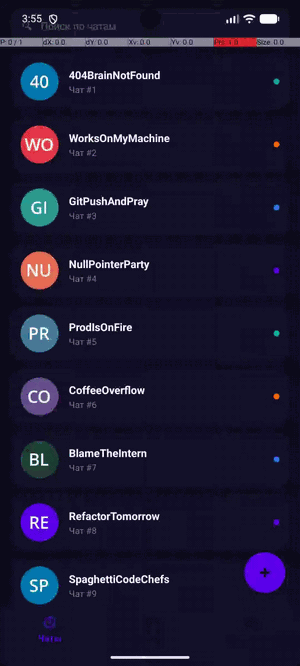
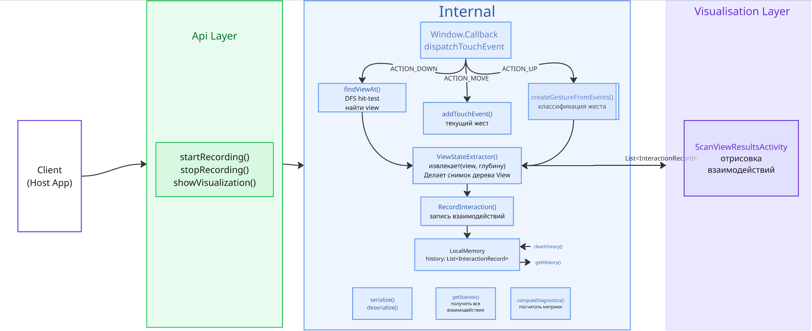
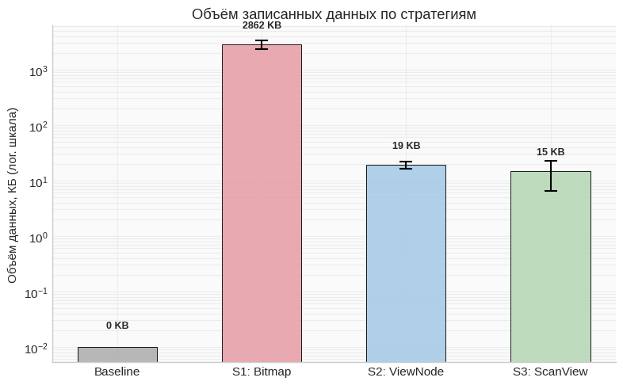
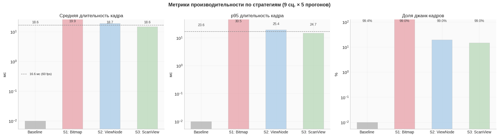
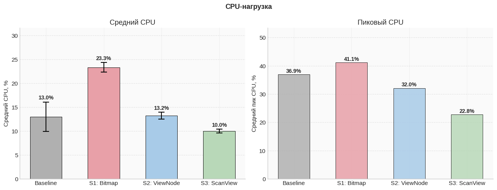
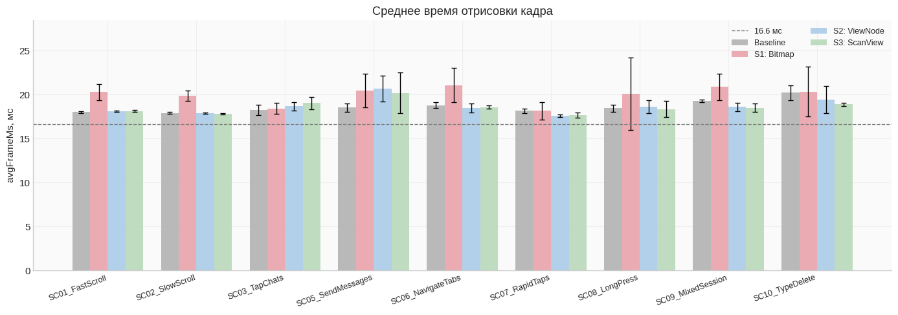
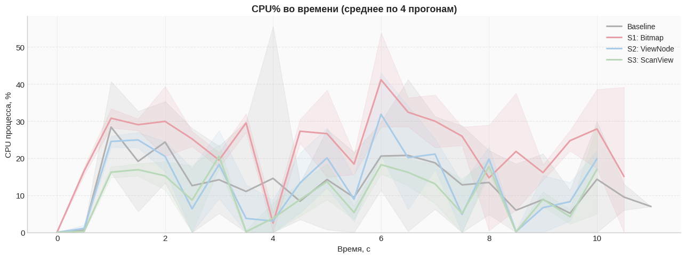

# ScanView

> Android-библиотека для **записи**, **сериализации** и **воспроизведения** сессий пользовательских взаимодействий без скриншотов и растровых снимков.

ScanView перехватывает события касания через `Window.Callback`, снимает структурный снимок затронутой View в момент взаимодействия, классифицирует жест (TAP / SWIPE / LONG\_PRESS / MOVE) и сохраняет всё в переносимый JSON-файл, который позже можно воспроизвести как пошаговую визуализацию.

## Демо



---

## Возможности

- **Захват без накладных расходов** — запись происходит только при касании экрана, а не по таймеру
- **Структура, а не картинка** — сохраняются деревья `ViewNode` (имена классов, границы, текст, фон), а не пиксельные растры
- **Классификация жестов** — автоматическое определение TAP / SWIPE / LONG\_PRESS / MOVE
- **Привязка к экрану** — каждая запись знает, какой фрагмент/экран был активен
- **Переносимый JSON** — сессии можно сохранять, передавать и воспроизводить на любом устройстве
- **Встроенная визуализация** — `ScanViewVisualizationView` отрисовывает сессию пошагово с ползунком перемотки
- **API диагностики** — FPS (FrameMetrics), доля распознанных виджетов (Q1), покрытие таймлайна (Q2), накладные расходы на событие

---

## Архитектура



## Как это работает

```
Пользователь касается экрана
        │
        ▼
Window.Callback.dispatchTouchEvent()   ← перехват до того, как UI отреагирует
        │
        ├── ACTION_DOWN  → запомнить целевую View, начать буфер жеста
        ├── ACTION_MOVE  → добавить в буфер (с прореживанием, максимум 8 точек)
        └── ACTION_UP    →
                ├── классифицировать жест   TAP / SWIPE / LONG_PRESS / MOVE
                ├── извлечь ViewNode   снимок дерева с ограничением глубины
                └── history.add(InteractionRecord)
                              │
                              └── serialize() → JSON-файл
```

Ключевое проектное решение: **захват по взаимодействию, а не по таймеру**. Это означает нулевую нагрузку на CPU между касаниями и объём данных, пропорциональный числу взаимодействий, а не длительности сессии.

---

## Быстрый старт

### 1. Подключение зависимости

ScanView поставляется как Gradle-модуль (исходники). Скопируйте каталог `scanview/` в свой проект, затем в `settings.gradle.kts`:

```kotlin
include(":scanview")
```

В `build.gradle.kts` вашего приложения:

```kotlin
dependencies {
    implementation(project(":scanview"))
}
```

### 2. Инициализация в Activity

```kotlin
class MainActivity : AppCompatActivity() {

    private val scanViewManager: ScanViewManager by lazy {
        ScanViewManagerFactory.create(object : ScanViewManagerDeps {
            override val context = this@MainActivity
            override val rootViewProvider: () -> View? = { window.decorView.rootView }
            override val activityProvider: (() -> Activity) = { this@MainActivity }
            override val logger: ((String, String) -> Unit) = { tag, msg -> Log.d(tag, msg) }
            // Необязательно, но можно также
            // передавать имя текущего экрана для более информативных данных сессии
            override val screenNameProvider: (() -> String) = {
                when (supportFragmentManager.findFragmentById(R.id.container)) {
                    is HomeFragment    -> "Home"
                    is ProfileFragment -> "Profile"
                    is ChatFragment    -> "Chat"
                    else               -> "Unknown"
                }
            }
        })
    }

    override fun onResume() {
        super.onResume()
        scanViewManager.startRecording()
    }

    override fun onPause() {
        super.onPause()
        scanViewManager.stopRecording()
    }
}
```

### 3. Сохранение сессии

```kotlin
private fun saveSession() {
    val history = scanViewManager.getHistory()
    if (history.isEmpty()) return
    val json = scanViewManager.serialize()
    val file = File(filesDir, "session_${System.currentTimeMillis()}.json")
    file.writeText(json)
}
```

### 4. Загрузка и визуализация

```xml
<com.example.scanview.visualization.ScanViewVisualizationView
    android:id="@+id/visualizationView"
    android:layout_width="match_parent"
    android:layout_height="0dp"
    android:layout_weight="1" />

<SeekBar
    android:id="@+id/seekBar"
    android:layout_width="match_parent"
    android:layout_height="wrap_content" />
```

```kotlin
val json = File(filesDir, "session.json").readText()
val history = scanViewManager.deserialize(json)

val m = resources.displayMetrics
visualizationView.setInteractions(history, m.widthPixels, m.heightPixels)

seekBar.max = (history.size - 1).coerceAtLeast(1)
seekBar.setOnSeekBarChangeListener(object : SeekBar.OnSeekBarChangeListener {
    override fun onProgressChanged(sb: SeekBar?, value: Int, fromUser: Boolean) {
        if (fromUser) visualizationView.setProgress(value.toFloat() / (history.size - 1))
    }
    override fun onStartTrackingTouch(sb: SeekBar?) {}
    override fun onStopTrackingTouch(sb: SeekBar?) {}
})
```

### 5. Список-таймлайн взаимодействий (опционально)

```kotlin
val adapter = InteractionAdapter(history) { record ->
    val idx = history.indexOf(record)
    visualizationView.goToStep(idx, history.size)
    seekBar.progress = idx
}
recyclerView.layoutManager = LinearLayoutManager(
    context, LinearLayoutManager.HORIZONTAL, false
)
recyclerView.adapter = adapter
```

---

## Модель данных

### `InteractionRecord`

```
InteractionRecord
├── screenName: String          "Chat", "Home" …
├── timestamp: Long             System.currentTimeMillis()
├── viewInfo: ViewInfo
│   ├── className: String       "AppCompatButton"
│   ├── idName: String?         "btnSend"  (null, если у view нет id)
│   ├── bounds: Rect?           ограничивающий прямоугольник в координатах экрана
│   ├── text: String?           текст для TextView / Button
│   └── viewNode: ViewNode?     структурный снимок (см. ниже)
└── gesture: Gesture
    ├── type: GestureType       TAP | SWIPE | LONG_PRESS | MOVE
    ├── startEvent: TouchEvent  x, y, timestamp в ACTION_DOWN
    ├── endEvent: TouchEvent?   x, y, timestamp в ACTION_UP
    └── moveEvents: List<TouchEvent>   прореженные промежуточные точки
```

### Правила классификации жестов

| Жест | Условие |
|---|---|
| `TAP` | Длительность ≤ 300 мс **и** расстояние < 20 dp |
| `SWIPE` | Расстояние > 100 dp |
| `LONG_PRESS` | Длительность > 500 мс **и** расстояние < 20 dp |
| `MOVE` | Всё остальное |

### `ViewNode` — структурный снимок

```
ViewNode
├── className: String            "ConstraintLayout", "TextView" …
├── bounds: Rect                 пиксели в координатах экрана
├── background: BackgroundState? Color(argb) | Unknown(drawableClass)
├── alpha: Float                 0.0 – 1.0
├── visibility: Int              View.VISIBLE = 0
├── content: ViewContent?        Text(text, color, size, bold)
│                                ImagePlaceholder(tint)
└── children: List<ViewNode>     до maxViewNodeDepth уровней
```

> **Почему не растры?** Объекты `Drawable` несериализуемы. ScanView извлекает только примитивные значения (цвета как int, строки, float) из иерархии View — ничего, что держит ссылки на `Canvas`, `Paint` или `Bitmap`.

---

## Визуализация

### `ScanViewVisualizationView`

Отрисовывает по одному взаимодействию за раз. Без наложений — ползунок дискретно перемещается по шагам.

```kotlin
// Загрузка данных
visualizationView.setInteractions(history, screenWidthPx, screenHeightPx)
visualizationView.setInteractions(history, screenW, screenH, VisualizationConfig(tapPointRadius = 30f))

// Перемотка
visualizationView.setProgress(0f)          // первый шаг
visualizationView.setProgress(1f)          // последний шаг
visualizationView.goToStep(3, history.size) // перейти к шагу с индексом 3
```

**Визуальные элементы:**

| Элемент | Описание |
|---|---|
| Скруглённые прямоугольники | Дерево ViewNode затронутой view |
| Точка касания (ripple) | Концентрические кольца + цветной центр |
| След SWIPE | Растущие градиентные точки → наконечник стрелки |
| Кольца LONG\_PRESS | Пульсирующие концентрические окружности |
| Верхний индикатор | Точки-шаги (≤18 шагов) или прогресс-бар |
| Нижняя панель | Имя экрана · шаг N/всего · тип жеста · цель · прошедшее время |

**Цветовое кодирование:**

| Жест | Цвет |
|---|---|
| TAP | `#00E676` зелёный |
| SWIPE | `#FF6D00` оранжевый |
| LONG\_PRESS | `#D500F5` фиолетовый |
| MOVE | `#00B0FF` синий |

### `VisualizationConfig`

```kotlin
data class VisualizationConfig(
    val tapPointRadius: Float = 22f,
    val swipeLineWidth: Float = 5f,
    val arrowLength:    Float = 24f
)
```

---

## Формат JSON

```json
{
  "statistics": {
    "totalInteractions": 5,
    "taps": 3,
    "swipes": 1,
    "moves": 0,
    "longPresses": 1,
    "uniqueViews": 4
  },
  "interactions": [
    {
      "screenName": "Chat",
      "viewInfo": {
        "className": "AppCompatButton",
        "id": 2131231234,
        "idName": "btnSend",
        "bounds": { "left": 820, "top": 1730, "right": 1000, "bottom": 1810 },
        "text": "Send",
        "viewNode": {
          "className": "AppCompatButton",
          "bounds": { "left": 820, "top": 1730, "right": 1000, "bottom": 1810 },
          "background": { "type": "unknown", "drawableClass": "RippleDrawable" },
          "alpha": 1.0,
          "visibility": 0,
          "content": { "type": "text", "text": "Send", "textColor": -1, "textSizePx": 48.0, "isBold": false },
          "children": []
        }
      },
      "gesture": {
        "type": "TAP",
        "startEvent": { "action": "ACTION_DOWN", "x": 910.0, "y": 1770.0, "localX": 90.0, "localY": 40.0, "timestamp": 1715000000000 },
        "endEvent":   { "action": "ACTION_UP",   "x": 910.0, "y": 1770.0, "localX": 90.0, "localY": 40.0, "timestamp": 1715000000120 },
        "moveEvents": []
      },
      "timestamp": 1715000000000
    }
  ],
  "timestamp": 1715000005000
}
```

---

## API диагностики

Для исследований и оценки производительности (метрики диплома M3, Q1, Q2):

```kotlin
// 1. Собираем FrameMetrics во время записи
private val frameDurations = mutableListOf<Double>()
private val frameListener = Window.OnFrameMetricsAvailableListener { _, metrics, _ ->
    if (scanViewManager.isRecording())
        frameDurations.add(metrics.getMetric(FrameMetrics.TOTAL_DURATION) / 1_000_000.0)
}

override fun onResume() {
    super.onResume()
    frameDurations.clear()
    window.addOnFrameMetricsAvailableListener(frameListener, Handler(mainLooper))
    scanViewManager.startRecording()
}

override fun onPause() {
    super.onPause()
    scanViewManager.stopRecording()
    window.removeOnFrameMetricsAvailableListener(frameListener)
    scanViewManager.setFrameMetricsData(frameDurations.toList())

    // 2. Вычисляем и логируем все метрики
    val m = scanViewManager.computeDiagnostics()
    Log.d("M3", "avg %.1f ms  p95 %.1f ms  jank %d/%d frames"
        .format(m.avgFrameMs, m.p95FrameMs, m.jankFrameCount, m.totalFrameCount))
    Log.d("Q1", "idName resolved %d/%d (%.0f%%)"
        .format(m.resolvedIdCount, m.totalInteractions, m.idNameResolutionRate * 100))
    Log.d("Q2", "max gap %d ms  avg gap %.0f ms"
        .format(m.maxTimestampGapMs, m.avgTimestampGapMs))
    Log.d("OVH", "event handling avg %.1f µs  max %d µs"
        .format(m.avgEventHandlingUs, m.maxEventHandlingUs))
}
```

### `DiagnosticMetrics`

| Поле | Метрика | Описание |
|---|---|---|
| `avgFrameMs` / `p95FrameMs` | M3 | Среднее и 95-й перцентиль времени кадра (мс) |
| `jankFrameCount` / `totalFrameCount` | M3 | Кадры, превысившие бюджет 16.6 мс |
| `idNameResolutionRate` | Q1 | Доля взаимодействий с распознанным `idName` (0.0–1.0) |
| `resolvedIdCount` / `totalInteractions` | Q1 | Абсолютные значения |
| `maxTimestampGapMs` / `avgTimestampGapMs` | Q2 | Максимальный и средний промежуток между метками времени |
| `avgEventHandlingUs` / `maxEventHandlingUs` | Overhead | Время в колбэке `dispatchTouchEvent` (микросекунды) |

---

## Справочник API

### `ScanViewManager`

| Метод | Возвращает | Описание |
|---|---|---|
| `startRecording()` | `Unit` | Установить перехватчик `Window.Callback`, очистить историю, начать захват |
| `stopRecording()` | `Unit` | Восстановить исходный колбэк, остановить захват |
| `isRecording()` | `Boolean` | Активен ли захват |
| `getHistory()` | `List<InteractionRecord>` | Все захваченные взаимодействия |
| `getStatistics()` | `InteractionStatistics` | Сводные счётчики по типам жестов |
| `serialize()` | `String` | Экспорт в форматированный JSON |
| `deserialize(json)` | `List<InteractionRecord>` | Импорт сохранённой сессии |
| `clearHistory()` | `Unit` | Сбросить все захваченные взаимодействия |
| `findViewAt(view, x, y)` | `View?` | Самая глубокая видимая View в экранных координатах |
| `captureViewNode(view, depth)` | `ViewNode?` | Извлечь дерево ViewNode из любой View |
| `computeDiagnostics()` | `DiagnosticMetrics` | Вычислить M3/Q1/Q2 и накладные расходы на событие |
| `setFrameMetricsData(durations)` | `Unit` | Передать длительности кадров для вычисления M3 |

---

## Требования

| | Значение |
|---|---|
| Min SDK | 24 (Android 7.0) |
| Compile / Target SDK | 36 |
| Kotlin | 1.9+ |
| Java | 21 |

**Встроенные зависимости** (добавлять вручную не нужно):
- `com.google.code.gson:gson:2.10.1`
- `org.jetbrains.kotlinx:kotlinx-coroutines-android:1.7.3`
- `androidx.recyclerview:recyclerview:1.3.2`
- `androidx.cardview:cardview:1.0.0`
- `androidx.appcompat:appcompat:1.6.1`

---

## Известные ограничения

| Ограничение | Примечание |
|---|---|
| Single-Activity | `Window.Callback` действует на уровне одной Activity. Для multi-Activity приложений нужен отдельный экземпляр на каждую Activity. |
| Кастомные View | View, отрисовывающиеся только в `onDraw()` без детей и фона, дают минимальный `ViewNode` (только className + bounds). Само касание при этом фиксируется корректно. |
| Приватность EditText | Содержимое текста захватывается. Для продакшена стоит маскировать чувствительные поля. |
| Фильтр видимости | В дерево `ViewNode` включаются только дети с `View.VISIBLE`. |
| Главный поток | Извлечение ViewNode выполняется синхронно в UI-потоке во время обработки касания. Измеренные накладные расходы: < 2 мс на взаимодействие на современных устройствах. |

---

## Результаты замеров производительности

Измерено на **Pixel 7** (Android 17, Google Tensor G2, 8 ГБ RAM, 2400×1080).
Сценарий: прокрутка списка + навигация по экранам, ~2 минуты.

### Сравнение стратегий

| Стратегия | Описание |
|---|---|
| **S1 Bitmap** | Периодический `View.drawToBitmap()` на 2 fps |
| **S2 ViewNode** | Периодический полный обход дерева ViewNode на 2 fps |
| **S3 ScanView** | Эта библиотека — захват только по взаимодействию пользователя |

### Результаты

| Метрика | Baseline | S1 Bitmap | S2 ViewNode | **S3 ScanView** |
|---|---|---|---|---|
| **M1 CPU max, %** | 7.3 | 28.4 | 8.9 | **10.5** |
| **M1 CPU delta, pp** | — | +21.1 | +1.6 | **+3.2** |
| **M4 Данные, КБ/мин** | — | 14 262 | 122.6 | **55.6** |
| **M4 vs S3** | — | 256× | 2.2× | **1×** |
| **M3 Среднее время кадра, мс** | ~5.5 | ~11 ¹ | ~7 ¹ | **6.1** |
| **M3 p95 время кадра, мс** | ~9 | ~52 ¹ | ~21 ¹ | **16.4** |
| **M3 Jank-кадры** | ~1–2% | ~22% ¹ | ~9% ¹ | **4.9% (23/473)** |
| **Q1 распознавание id** | n/a | n/a | n/a | **83% (15/18)** |
| **Overhead на событие, среднее** | n/a | n/a | n/a | **74.1 µs** |
| **Overhead на событие, макс** | n/a | n/a | n/a | **1 243 µs** |

> ¹ Оценка по наблюдениям за CPU; напрямую через FrameMetrics не измерялось.

### Графики

**Объём записанных данных (M4).** Логарифмическая шкала: S1 Bitmap записывает в сотни раз больше, чем S2 и S3.



**Производительность отрисовки (M3).** Средняя и p95 длительность кадра, доля джанк-кадров (9 сценариев × 5 прогонов, планки погрешности — 95% ДИ).



**Нагрузка на CPU (M1).** Средний и пиковый CPU по стратегиям.



<details>
<summary>Детальные графики (по сценариям и во времени)</summary>

Средняя длительность кадра в разрезе каждого сценария:



Динамика CPU во времени (усреднение по прогонам):



</details>

### Ключевые выводы

**Объём данных (M4):** S3 генерирует **в 256× меньше данных, чем S1** и **в 2.2× меньше, чем S2**.
S1 хранит сырые растры ARGB_8888 (≈10 МБ/кадр без сжатия, ≈135 КБ/кадр в PNG); S3 хранит только структурный снимок в момент касания.

**Накладные расходы CPU (M1):** S3 добавляет **+3.2 pp** к базовой линии без записи.
S1 добавляет +21.1 pp — почти в 7× больше, чем S3.

**Время кадров (M3):** среднее время кадра S3 — **6.1 мс**, уверенно внутри бюджета 16.6 мс.
p95 = 16.4 мс — 95% кадров без подёргиваний на протяжении всей сессии.

**Идентификация виджетов (Q1):** **83%** взаимодействий разрешаются в именованный resource ID (`idName`).
Оставшиеся 17% — это view без явного Android-id (программные или сторонние).

**Накладные расходы на касание:** в среднем **74  на один MotionEvent** — незаметно для пользователя (порог восприятия ≈ 10 мс).
